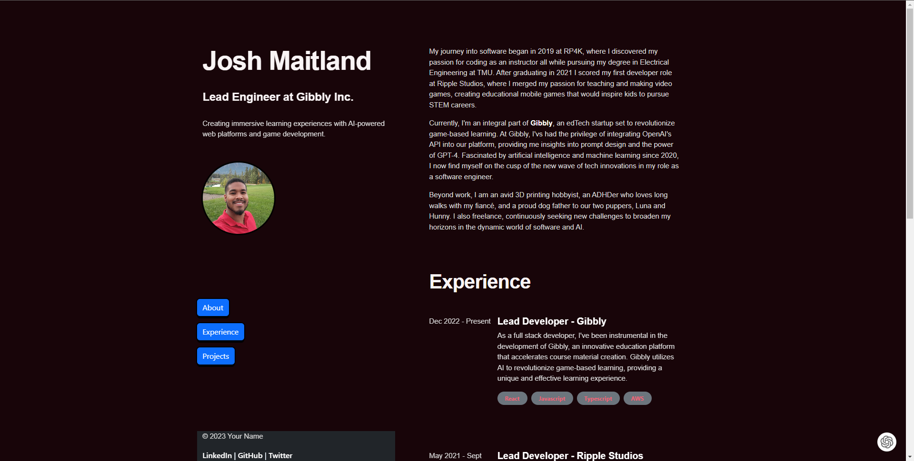

# Josh Maitland's Portfolio [Website](https://joshmaitland.ca)

## Overview

This repository contains the source code for my portfolio website. I'm currently a Lead Engineer at Gibbly Inc., where I create immersive learning experiences with AI-powered web platforms and game development.

## About Me

My journey into software began in 2019 at RP4K, where I discovered my passion for coding as an instructor while pursuing my degree in Electrical Engineering at TMU. Currently, I'm an integral part of Gibbly, an edTech startup set to revolutionize game-based learning. Beyond work, I'm an avid 3D printing hobbyist, an ADHDer who loves long walks with my fiancé, and a proud dog father to our two puppers, Luna and Hunny. I also freelance, continuously seeking new challenges to broaden my horizons in the dynamic world of software and AI.

## Experience

- **Lead Developer - Gibbly** (Dec 2022 - Present)
  - As a full stack developer, I've been instrumental in the development of Gibbly, an innovative education platform that accelerates course material creation. Gibbly utilizes AI to revolutionize game-based learning, providing a unique and effective learning experience.
  - Tech Stack: React, Javascript, Typescript, AWS

- **Lead Developer - Ripple Studios** (May 2021 - Sept 2022)
  - As a full stack developer, I've been instrumental in the development of educational mobile games that inspire kids to pursue STEM careers.
  - Tech Stack: C#, Unity

## Projects

- **F.O.A.C. Technical Manufacturing**
  - I had the exciting challenge of creating a dynamic and streamlined website for F.O.A.C. Technical Manufacturing and Training Corp.
  - Tech Stack: HTML, CSS, Squarespace

- **Algorithm Visualizer**
  - I've always found those algorithm visualization videos on Youtube super satisfying to watch, so in an attempt to better grasp basic sorting algorithms I took a stab at coding them myself, but took it a step further and used Pygame to visualize them. I then figured out how to host the program on a website called trinket.io.
  - [Check out the demo](https://trinket.io/pygame/d1a55c7216?outputOnly=true)

## Connect with Me

- [LinkedIn](https://www.linkedin.com/in/josh-maitland/)
- [GitHub](https://github.com/jmaitlandsoto)

## License

This project is open source and available under the [MIT License](LICENSE).
