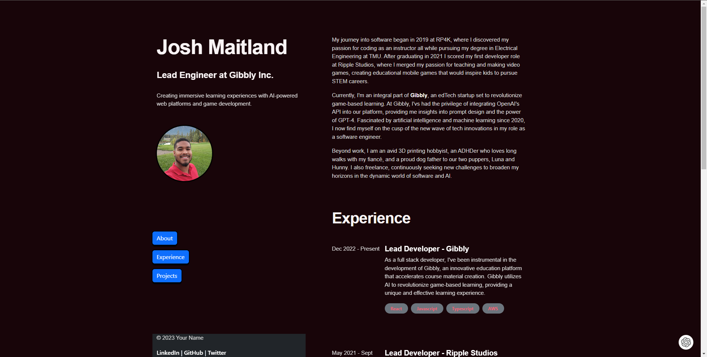

# Josh Maitland's Portfolio [Website](https://joshmaitland.ca)

## Overview

This repository contains the source code for my portfolio website. I'm a full-stack software engineer based in Toronto, currently building distributed systems at Iceberg Cyber and co-founding Gibbly, an AI edtech platform.

## About Me

My journey into software began in 2020 as a coding instructor at RP4K, while pursuing my degree in Electrical Engineering at TMU. From there I led game development at Ripple Studios before landing at Gibbly, an edTech startup I co-founded, and Iceberg Cyber, where I architect distributed, event-driven systems on AWS. Beyond work, I'm an avid 3D printing hobbyist, an ADHDer who loves long walks with my fiancé, and a proud dog father to our two puppers, Luna and Hunny. I also volunteer as a certified Judge Advisor for VEX Robotics competitions.

## Experience

- **Full Stack Developer - Iceberg Cyber** (June 2024 - Present)
  - Architecting distributed, event-driven systems on AWS (CDK, Lambda, SQS, RDS, DynamoDB), including RBAC for multi-tenant client isolation and CI/CD pipelines.
  - Tech Stack: TypeScript, Node.js, AWS CDK, Lambda, DynamoDB, Bitbucket Pipelines

- **Technical Co-Founder - Gibbly** (Dec 2022 - Present)
  - Sole developer for an AI edtech platform serving ~36,000 users, building agentic AI automation, LLM evaluation, and guardrails on the OpenAI API.
  - Tech Stack: React, TypeScript, OpenAI API, GraphQL, AWS, PostHog

- **Lead Game Developer - Ripple Studios** (May 2021 - Oct 2022)
  - Instrumental in the development of educational mobile games that inspire kids to pursue STEM careers.
  - Tech Stack: C#, .NET, Unity

- **Coding Instructor - Real Programming 4 Kids** (Jan 2020 - Aug 2021)
  - Taught and mentored 100+ students in Python, Java, C#, C++, and Visual Basic.

## Projects

- **F.O.A.C. Technical Manufacturing**
  - I had the exciting challenge of creating a dynamic and streamlined website for F.O.A.C. Technical Manufacturing and Training Corp.
  - Tech Stack: HTML, CSS, Squarespace

- **Algorithm Visualizer**
  - I've always found those algorithm visualization videos on Youtube super satisfying to watch, so in an attempt to better grasp basic sorting algorithms I took a stab at coding them myself, but took it a step further and used Pygame to visualize them. I then figured out how to host the program on a website called trinket.io.
  - [Check out the demo](https://trinket.io/pygame/d1a55c7216?outputOnly=true)

## Connect with Me

- [LinkedIn](https://www.linkedin.com/in/josh-maitland/)
- [GitHub](https://github.com/jmaitlandsoto)

## Docker

You can use docker to host this on your own machine. You make sure you have [Docker Desktop](https://docs.docker.com/desktop/) installed and running.

Clone the repo.

Start the docker container.

`docker compose up --build --detatch`

Open [localhost:5173](http://localhost:5173)

## License

This project is open source and available under the [MIT License](LICENSE).
